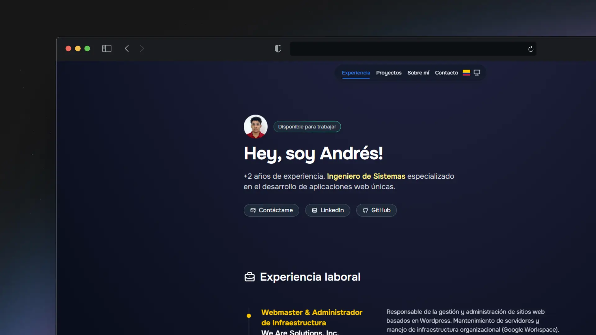

# Portfolio Personal - Andrés Cuello

## 💡 Base del Proyecto

Este proyecto está basado en el excelente trabajo de **Miguel Ángel Durán (midudev)** y su plantilla de portfolio.

- **Proyecto Original:** [midudev/porfolio.dev](https://github.com/midudev/porfolio.dev)

- **Autor Original:** [midudev](https://github.com/midudev)

Gran parte de la estructura, configuración inicial y prácticas de desarrollo fueron adoptadas de este repositorio. Agradecimientos a Midudev por compartir su trabajo con la comunidad.
